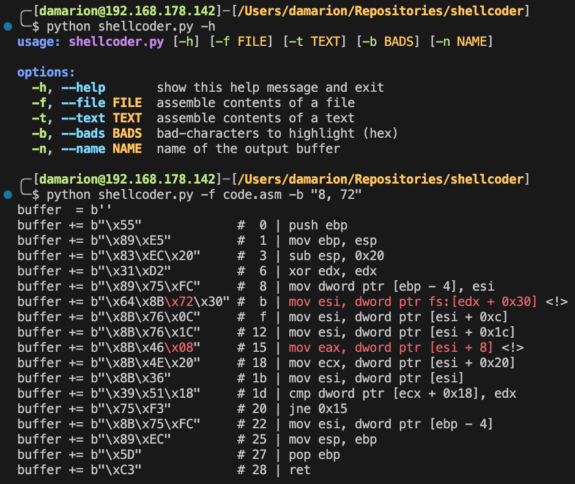

_Shellcoder_ is an assembler built specifically for use during the Offensive Security Exploit Developer (OSED) exam. It's extremely simple by design, converting assembly in text or file form into a Python buffer with helpful comments for debugging. Take, for example, the shellcode that resolves the base address of `kernel32.dll` by walking the [Process Environment Block](https://en.wikipedia.org/wiki/Process_Environment_Block) (`PEB`):

```nasm
getkrnl32:
    push ebp
    mov ebp, esp
    sub esp, 0x20
    xor edx, edx
    mov dword ptr [ebp-0x04], esi
    mov esi, fs:[edx+0x30]
    mov esi, [esi+0x0C]
    mov esi, [esi+0x1C]
getkrnl32_next:
    mov eax, [esi+0x08]
    mov ecx, [esi+0x20]
    mov esi, [esi]
    cmp dword ptr [ecx+0x18], edx
    jne getkrnl32_next
getkrnl32_exit:
    mov esi, [ebp-0x04]
    mov esp, ebp
    pop ebp
    ret
```

Where `msfvenom` gives you a dump of bytes that aren't easily modifiable individually, this tool displays the shellcode on a per-line basis, with its original assembly beside the bytecode. It also highlights bad characters in the terminal and marks any affected line with `<!>`, so you can find it easily in a text editor, where colours don't apply.


