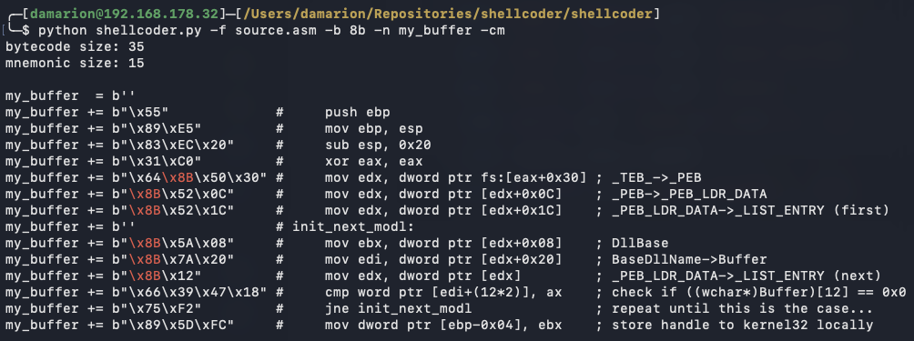

Shellcoder is a portable assembler that utilises Keystone and Capstone to
convert source files to a Python buffer with informative comments. It has been
designed to utilise the DLLs that are shipped with it to ensure usability
on all x86 Windows systems, as long as Python 3.9.6 is installed.

While MSFvenom would dump a block of bytecode after its payload generation,
Shellcoder formats its buffer to match the normalised assembly code, providing
useful details while debugging your payload. Additionally, it features routine
enhancements such as bad-character highlighting and mnemonic size annotation.

Below is an example of its usage, where we make use of the payload that
resolves `kernel32.dll` by walking the Process Environment Block (PEB):

This script is meant to be run on Windows 10 (x86). To support this expectation,
the following design choices have been made during its development:

- All provided DLLs are compiled in 32-bit mode;
- The code has been tested on Python 3.9.6;
- VT processing is enabled for colour support;

Finally, I'd like to mention that this script does not contain any intelligent
features; it merely attempts to minimise tedium.
